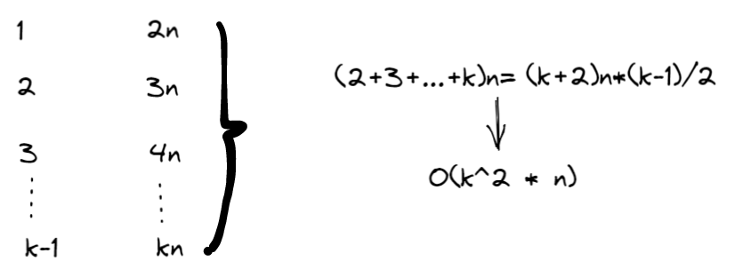

## Problem

#### [23. 合并K个升序链表](https://leetcode-cn.com/problems/merge-k-sorted-lists/)

++

难度困难1659

给你一个链表数组，每个链表都已经按升序排列。

请你将所有链表合并到一个升序链表中，返回合并后的链表。

------

### Note

- **分治：**

- 时间O：kn*logk

- 空间O：log(k), k 是list的个数

- s时间复杂度分析：第一次：k/2组，每一组需要2n次合并；第二次，k/4组，每组需要4n次合并，...时间复杂度如下：

- $$
  \sum_{i=1}^{log_2k}k/2^i * 2^in=\sum_{i=1}^{log_2k}kn=kn*logk
  $$

**按顺序：**

- 时间复杂度为k^2 * n。
- 
- 时间复杂度分析：第一次合并需要的时间
- 空间复杂度：1


------

### Complexity

- 时间O：-
- 空间O：-

------

### Python

```python
分治


class Solution:
    def mergeKLists(self, lists: List[ListNode]) -> ListNode:
        if not lists:
            return 
        n = len(lists)
        return self.merge(lists, 0, n-1)
    def merge(self,lists, left, right):
        if left == right:
            # 直接返回该链表
            return lists[left]
        mid = left + (right - left) // 2
        return self.mergeTwoLists(self.merge(lists, left, mid), self.merge(lists, mid + 1, right))
        
    def mergeTwoLists(self,l1, l2):
        if not l1:
            return l2
        if not l2:
            return l1

        dummy = ListNode(0)
        pre = dummy
        while l1 and l2:
            if l1.val < l2.val:
                pre.next = l1
                l1 = l1.next
            else:
                pre.next = l2
                l2 = l2.next
            pre = pre.next
        if l1:
            pre.next = l1
        if l2:
            pre.next = l2
        return dummy.next
```


```python
顺序
class Solution:
    def mergeKLists(self, lists: List[ListNode]) -> ListNode:
        if not lists:
            return None
        res = lists[0]
        for li in lists[1:]:
            res = self.mergeTwoLists(res, li)
        return res

    def mergeTwoLists(self, l1, l2):
        if not l1:
            return l2
        if not l2:
            return l1
        dummy = ListNode(0)
        pre = dummy
        while l1 and l2:
            if l1.val < l2.val:
                pre.next = l1
                l1 = l1.next
            else:
                pre.next = l2
                l2 = l2.next
            pre = pre.next
        
        if l1:
            pre.next = l1
        if l2:
            pre.next = l2

        return dummy.next
```


### C++

```C++
显然。
```


From : https://github.com/dahaiyidi/awsome-leetcode
