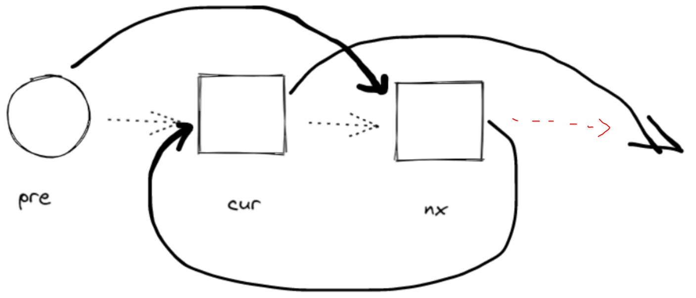

## Problem

#### [24. 两两交换链表中的节点](https://leetcode-cn.com/problems/swap-nodes-in-pairs/)

难度中等1173

给你一个链表，两两交换其中相邻的节点，并返回交换后链表的头节点。你必须在不修改节点内部的值的情况下完成本题（即，只能进行节点交换）。

------

### Note

- 简单的反转链表

- 为了更加通用，设置应该nx.next = pre.next, 而不是nx.next = cur, 因为在别的反转题目中，cur与pre中间可能还有节点，如每3个反转

- 

  

- 

  

------

### Complexity

- 时间O：n
- 空间O：1

------

### Python

```python

class Solution:
    def swapPairs(self, head: ListNode) -> ListNode:
        if not head:
            return head
        
        dummy = ListNode(0, head)
        #  初始化pre, cur
        pre = dummy
        cur = dummy.next
        while cur and cur.next:
            nx = cur.next
            cur.next = nx.next
            nx.next = pre.next
            pre.next = nx
            # 下一循环的pre，cur
            pre = cur
            cur = cur.next
        return dummy.next
```

### C++

```C++

class Solution {
public:
    ListNode* swapPairs(ListNode* head) {
        if(!head){
            return head;
        }
        ListNode* dummy = new ListNode(0, head);
        ListNode* pre = dummy;
        ListNode* cur = pre->next;
        while(cur && cur->next){
            ListNode* nx = cur->next;
            cur->next = nx->next;
            nx->next = pre->next;
            pre->next = nx;
            pre = cur;
            cur = cur->next;
        }
        return dummy->next;
    }
};
```


From : https://github.com/dahaiyidi/awsome-leetcode
