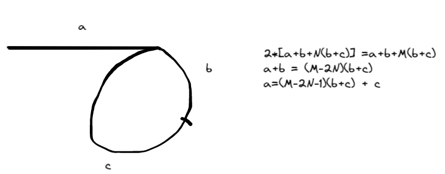

## Problem

#### [142. 环形链表 II](https://leetcode-cn.com/problems/linked-list-cycle-ii/)

++

给定一个链表，返回链表开始入环的第一个节点。 如果链表无环，则返回 `null`。

------

### Note

- 利用快慢指针
- 在相交点处，将slow设置为head, fast停留在相交点。 然后fast和slow每次均移动一步，再次相交点就是进入环的第一个节点
- 注意：初始状态为： slow = fast = head
- 

------

### Complexity

- 时间O：n
- 空间O：1

------

### Python

```python
#python
class Solution:
    def detectCycle(self, head: ListNode) -> ListNode:
        # if not head or not head.next:
        #     return None

        slow = head
        fast = head
        # 寻找交点
        while fast and fast.next:
            slow = slow.next
            fast = fast.next.next
            if slow == fast:
                break
                
        # 无环
        # print(fast, fast.next)
        if not fast or not fast.next:
            return None
        
        #有环
        slow = head
        while slow != fast:
            slow = slow.next
            fast = fast.next
        return slow
```

### C++

```C++
class Solution {
public:
    ListNode *detectCycle(ListNode *head) {
        if(head == nullptr || head->next == nullptr)
        {
            return nullptr;
        }
        ListNode* slow = head->next;
        ListNode* fast = head->next->next;

        while(fast && fast->next && slow != fast)
        {
            slow = slow->next;
            fast = fast->next->next;
        }
        // 没有环
        if(fast == nullptr || fast->next == nullptr)
        {
            return nullptr;
        }
        // 有环，需要寻找
        fast = head;
        while(fast != slow)
        {
            fast = fast->next;
            slow = slow->next;
        }
        return slow;        
    }
};

由于需要判断slow == fast,如果直接将slow =fast=head,则可以这样写
    class Solution {
public:
    ListNode *detectCycle(ListNode *head) {
        if(head == nullptr)
        {
            return nullptr;
        }
        ListNode* slow = head;
        ListNode* fast = head;

        while(fast && fast->next)
        {
            slow = slow->next;
            fast = fast->next->next;
            if (slow == fast)
            {
                break;
            }
        }
        // 没有环
        if(fast == nullptr || fast->next == nullptr)
        {
            return nullptr;
        }
        // 有环，需要寻找
        fast = head;
        while(fast != slow)
        {
            fast = fast->next;
            slow = slow->next;
        }
        return slow;        
    }
};


其他写法：

# c++
class Solution {
public:
    ListNode *detectCycle(ListNode *head) {
        ListNode* slow = head;
        ListNode* fast = head;
        
        while(fast)
        {
            slow = slow->next;
            if(!fast->next)
            {
                return nullptr;
            }
            fast = fast->next->next;
            if(slow == fast)
            {
                fast = head;
                while(slow != fast)
                {
                    slow = slow->next;
                    fast = fast->next;
                }
                return fast;
            }
        }
        return nullptr;
          
    }
};
```


点击链接查看leetcode题目总结。若不总结，则永远陷入刷题的无底洞！**你所畏惧的一切，终将一个个地面对！**

From : :heart: https://github.com/dahaiyidi/awsome-leetcode
