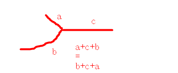

## Problem

#### [160. 相交链表](https://leetcode-cn.com/problems/intersection-of-two-linked-lists/)

++

给你两个单链表的头节点 `headA` 和 `headB` ，请你找出并返回两个单链表相交的起始节点。如果两个链表不存在相交节点，返回 `null` 。

题目数据 **保证** 整个链式结构中不存在环。

**注意**，函数返回结果后，链表必须 **保持其原始结构** 。

------

### Note

- 直接看下图：
- 

------

### Complexity

- 时间O：m + n
- 空间O：1

------

### Python

```python
class Solution:
    def getIntersectionNode(self, headA: ListNode, headB: ListNode) -> ListNode:
        if not headA or not headB:
            return None

        l1 = headA
        l2 = headB
        flag = False
        while l1 != l2:
            l1 = l1.next if l1 else headB
            l2 = l2.next if l2 else headA

        return l1
```

### C++

```C++
    ListNode *getIntersectionNode(ListNode *headA, ListNode *headB) {
        if(headA==NULL || headB==NULL)
            return NULL;
        ListNode * p1=headA;
        ListNode* p2= headB;
        while(p1!=p2){
            p1=p1==NULL?headB:p1->next;
            p2=p2==NULL?headA:p2->next;
        }
        return p1;        
    }
```


From : https://github.com/dahaiyidi/awsome-leetcode
