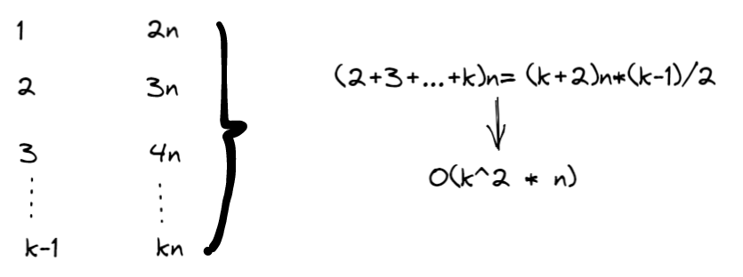

## Problem

#### [876. 链表的中间结点](https://leetcode-cn.com/problems/middle-of-the-linked-list/)


给定一个头结点为 head 的非空单链表，返回链表的中间结点。

如果有两个中间结点，则返回第二个中间结点。

------

### Note

- **分治：**

- 时间O：kn*logk

- 空间O：log(k), k 是list的个数

- s时间复杂度分析：第一次：k/2组，每一组需要2n次合并；第二次，k/4组，每组需要4n次合并，...时间复杂度如下：

- $$
  \sum_{i=1}^{log_2k}k/2^i * 2^in=\sum_{i=1}^{log_2k}kn=kn*logk
  $$

**按顺序：**

- 时间复杂度为k^2 * n。
- 
- 时间复杂度分析：第一次合并需要的时间
- 空间复杂度：1


------

### Complexity

- 时间O：n
- 空间O：1

------

### Python


```python

class Solution:
    def middleNode(self, head: ListNode) -> ListNode:
        slow = head
        fast = head
        while fast and fast.next:
            slow = slow.next
            fast = fast.next.next
        return slow
```


### C++

```C++
显然。
```


From : https://github.com/dahaiyidi/awsome-leetcode
