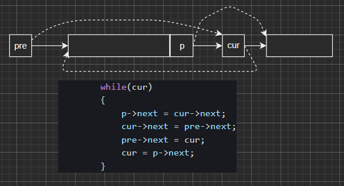

## Problem

#### [剑指 Offer 24. 反转链表](https://leetcode-cn.com/problems/fan-zhuan-lian-biao-lcof/)

简单

定义一个函数，输入一个链表的头节点，反转该链表并输出反转后链表的头节点。

 

**示例:**

```
输入: 1->2->3->4->5->NULL
输出: 5->4->3->2->1->NULL
```

 

------

### Note

- 思路不难
- 关键点：
  - dummy
  - 找到pre， cur, nx的节点，根据更新方式更新即可。3个节点的图如下，非常简单。
  - 


------

### Complexity

- 时间O：N
- 空间O：1

------

### Python

```python

```

### C++

```C++
/**
 * Definition for singly-linked list.
 * struct ListNode {
 *     int val;
 *     ListNode *next;
 *     ListNode(int x) : val(x), next(NULL) {}
 * };
 */
class Solution {
public:
    ListNode* reverseList(ListNode* head) {
        if(!head || !head->next)
        {
            return head;
        }

        ListNode* dummy = new ListNode(-1);
        dummy->next = head;

        ListNode* pre = dummy;
        ListNode* cur = head;
        ListNode* nx = head->next;
        while(nx)
        {
            cur->next = nx->next;
            nx->next = pre->next;
            pre->next = nx;
            nx = cur->next;
        }       
        return dummy->next;
    }
};
```


From : https://github.com/dahaiyidi/awsome-leetcode
