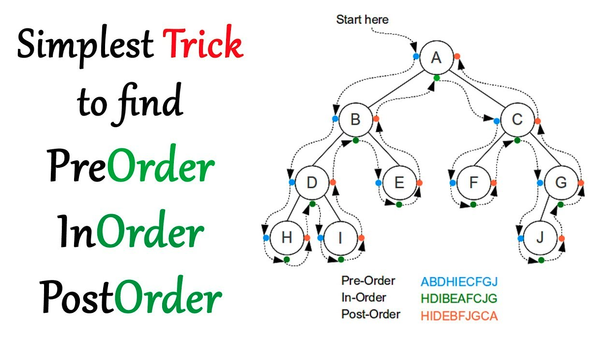

## Think deeply-树总结

## 主要题型

- :heart:**题目主要分为这几类**（主要是前面两类）：
  
  - 遍历
  - 递归。 下面有递归专题
  - 部分情况下，还是披着树外衣的动态规划。。。
- :warning:  需要注意的边界条件：

  - root为nullptr的边界情况

## 二叉树遍历

- 二叉树的前、中、后序遍历，:heart: 在 [94. 二叉树的中序遍历](https://leetcode-cn.com/problems/binary-tree-inorder-traversal/) +++++ 的题解中有详细的阐述。
  - 三种思路：递归、迭代(非统一形式和统一形式)、:heart: **morris**（竟然空间复杂度只需要1）
  -  **morris**遍历的核心思想是利用树的大量空闲指针，实现空间开销的极限缩减
  - 此处的操作有一点点像morris的做法，共同的步骤：将某节点放置在左子树的最右子树的right上。::heart:[114. 二叉树展开为链表](https://leetcode.cn/problems/flatten-binary-tree-to-linked-list/)



from: https://leetcode.cn/problems/convert-bst-to-greater-tree/solution/yi-tao-quan-fa-shua-diao-nge-bian-li-shu-de-wen-5/

- 很多题目可以直接在遍历的基础上修改
  - [814. 二叉树剪枝](https://leetcode-cn.com/problems/binary-tree-pruning/)
  - [230. 二叉搜索树中第K小的元素](https://leetcode-cn.com/problems/kth-smallest-element-in-a-bst/)
  - 右中左遍历：
    - [剑指 Offer 54. 二叉搜索树的第k大节点](https://leetcode-cn.com/problems/er-cha-sou-suo-shu-de-di-kda-jie-dian-lcof/)++
    - [538. 把二叉搜索树转换为累加树](https://leetcode.cn/problems/convert-bst-to-greater-tree/) ++
  - [98. 验证二叉搜索树](https://leetcode-cn.com/problems/validate-binary-search-tree/)： 利用中序遍历，是有序的；利用递归，递归判断左子树是否小于根节点，右子树是否均>根节点


- 层序遍历(只要会了基础的写法，所有问题只是在层序遍历上的微操而已)
    - [102. 二叉树的层序遍历](https://leetcode-cn.com/problems/binary-tree-level-order-traversal/)

    - #### [513. 找树左下角的值](https://leetcode-cn.com/problems/find-bottom-left-tree-value/)

    - [103. 二叉树的锯齿形层序遍历](https://leetcode-cn.com/problems/binary-tree-zigzag-level-order-traversal/)

    - :heart_eyes:[297. 二叉树的序列化与反序列化](https://leetcode-cn.com/problems/serialize-and-deserialize-binary-tree/)++ 对于c++，采用ostringstream和istringstream可以简化程序，方便的split字符串
    
    - 模仿层序遍历：
    
      - :heart:[116. 填充每个节点的下一个右侧节点指针](https://leetcode-cn.com/problems/populating-next-right-pointers-in-each-node/)++
    
    - BFS，层序遍历，最短路径是递进的关系
      - 在BFS 上记录区分遍历的每一层 -> 层序遍历
      - 在层序遍历的基础上记录层数 -> 最短路径
    
    - 应用在最短路径（图的BFS）：[1162. 地图分析](https://leetcode-cn.com/problems/as-far-from-land-as-possible/)++
      - tree只有一个root；而图可以有多个起始节点，都添加进入queue即可。
      - tree是有方向的，无需代表是否访问过的标志位；但是图需要标志位
    
    - 看似是层序遍历，其实是动规[337. 打家劫舍 III](https://leetcode.cn/problems/house-robber-iii/) ++
    
- 垂序遍历

    - [987. 二叉树的垂序遍历](https://leetcode-cn.com/problems/vertical-order-traversal-of-a-binary-tree/)++

## 判断遍历序列是否正确

- [剑指 Offer 33. 二叉搜索树的后序遍历序列](https://leetcode-cn.com/problems/er-cha-sou-suo-shu-de-hou-xu-bian-li-xu-lie-lcof/)++

## 递归 / 二叉树属性

- :heart_decoration:**树天生适合递归，解决树的属性的问题。**

- :heart:**当发现无法通过遍历来解决问题，则可以考虑用递归。**[124. 二叉树中的最大路径和](https://leetcode.cn/problems/binary-tree-maximum-path-sum/)++

- ```c++
  - 显然题目不能通过遍历解决，那就考虑递归，因为树天生就适合递归
  - 二话不说，先把递归的形式写出来
  - 然后考虑函数代表的含义，做好结果返回，做好终止返回，就ok了
  ```

- 有些题目虽然看上去挺唬人的，只要把递归形式写出来，定义好dfs函数的功能，就简单多了。

- 题目：

- [437. 路径总和 III](https://leetcode.cn/problems/path-sum-iii/) +++  结合前缀和的递归。

- [100. 相同的树](https://leetcode-cn.com/problems/same-tree/)

- [129. 求根节点到叶节点数字之和](https://leetcode-cn.com/problems/sum-root-to-leaf-numbers/)++

- 树的子结构：[剑指 Offer 26. 树的子结构](https://leetcode-cn.com/problems/shu-de-zi-jie-gou-lcof/)

- [剑指 Offer 27. 二叉树的镜像](https://leetcode-cn.com/problems/er-cha-shu-de-jing-xiang-lcof/)

- [101. 对称二叉树](https://leetcode-cn.com/problems/symmetric-tree/)

- 深度问题：
   -  [104. 二叉树的最大深度 ](https://leetcode-cn.com/problems/maximum-depth-of-binary-tree/) 
   -  [111. 二叉树的最小深度](https://leetcode-cn.com/problems/minimum-depth-of-binary-tree/)

- :heart: 公共祖先：
   -  [235. 二叉搜索树的最近公共祖先](https://leetcode-cn.com/problems/lowest-common-ancestor-of-a-binary-search-tree/)++  利用二叉搜索树的特点
   -  [236. 二叉树的最近公共祖先](https://leetcode-cn.com/problems/lowest-common-ancestor-of-a-binary-tree/)++  利用后续遍历

- [110. 平衡二叉树](https://leetcode-cn.com/problems/balanced-binary-tree/)++

- [257. 二叉树的所有路径](https://leetcode-cn.com/problems/binary-tree-paths/)++

- [剑指 Offer 34. 二叉树中和为某一值的路径](https://leetcode-cn.com/problems/er-cha-shu-zhong-he-wei-mou-yi-zhi-de-lu-jing-lcof/)++

- [226. 翻转二叉树](https://leetcode.cn/problems/invert-binary-tree/)

- [543. 二叉树的直径](https://leetcode.cn/problems/diameter-of-binary-tree/) --

- [617. 合并二叉树](https://leetcode.cn/problems/merge-two-binary-trees/) 

## 二叉树重建：

- 重要的思想是：首先找到根节点，根据根节点在另外一个序列中找到对应的位置以区分左右子树。
- 前+中，可以唯一确定树结构
- 后+中，可以唯一确定树结构
- 前+后，不能唯一确定树结构
- [105. 从前序与中序遍历序列构造二叉树](https://leetcode-cn.com/problems/construct-binary-tree-from-preorder-and-inorder-traversal/)++
- [106. 从中序与后序遍历序列构造二叉树](https://leetcode-cn.com/problems/construct-binary-tree-from-inorder-and-postorder-traversal/)
- [889. 根据前序和后序遍历构造二叉树](https://leetcode-cn.com/problems/construct-binary-tree-from-preorder-and-postorder-traversal/)++
- [1008. 前序遍历构造二叉搜索树](https://leetcode-cn.com/problems/construct-binary-search-tree-from-preorder-traversal/)++


## 二叉搜索树

- 二叉搜索树是比较特殊的树，特点主要是：
  - 其中序遍历结果是递增的

  - 在二叉搜索树的搜索过程和分治非常类似。因此很多题目会和分治结合起来。最多的时候就是使用1/2的分治
    - 使用递归实现
    
    - ```c++
              int mid = left + ((right - left) >> 1);
              TreeNode* root = new TreeNode(nums[mid]);
              root->left = fun(nums, left, mid - 1);
              root->right = fun(nums, mid + 1, right);
      ```

- 转换为二叉搜索树

  - [109. 有序链表转换二叉搜索树](https://leetcode-cn.com/problems/convert-sorted-list-to-binary-search-tree/)++
  - [108. 将有序数组转换为二叉搜索树](https://leetcode-cn.com/problems/convert-sorted-array-to-binary-search-tree/)

- 二叉搜索树转换为链表：

  - 【链表】专题：[剑指 Offer 36. 二叉搜索树与双向链表](https://leetcode.cn/problems/er-cha-sou-suo-shu-yu-shuang-xiang-lian-biao-lcof/) 

- 二叉搜索树与动态规划

  - :heart:[96. 不同的二叉搜索树](https://leetcode-cn.com/problems/unique-binary-search-trees/)

## 完美二叉树与二分查找


  - 主要考察：**二分查找，完美二叉树节点个数范围与高度的关系，节点编号与二进制的关系（根节点为1，从左面第2位开始，0代表选择left， 1代表选择right）**


  - :heart:[222. 完全二叉树的节点个数](https://leetcode-cn.com/problems/count-complete-tree-nodes/)++

- :heart: 前缀树
  - [208. 实现 Trie (前缀树)](https://leetcode-cn.com/problems/implement-trie-prefix-tree/)++
    - [677. 键值映射](https://leetcode-cn.com/problems/map-sum-pairs/)++
    - [面试题 17.17. 多次搜索](https://leetcode-cn.com/problems/multi-search-lcci/)++

------

