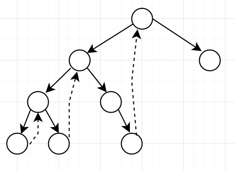

## Problem

#### [94. 二叉树的中序遍历](https://leetcode-cn.com/problems/binary-tree-inorder-traversal/)

+++

+++

给定一个二叉树的根节点 `root` ，返回它的 **中序** 遍历。

------

### Note

- 三种思路：（都需要掌握）
  - 递归。依靠这个，基本上拿不出手。。。
  - 迭代
    - 狭义上非统一的形式：依靠stack模仿递归。其实广义上来讲，**后续遍历是在中序遍历的基础上修改而成的**。
    - 统一的形式
  - Morris中序遍历
    - 建立一种机制，**对于没有左子树的节点只到达一次，对于有左子树的节点会到达两次**
    - **后续遍历是在中序遍历的基础上修改而成的**
  
- **本题的还总结了，前序、中序、后序在三种思路中的写法。**

- 相关题目：

  - [145. 二叉树的后序遍历](https://leetcode-cn.com/problems/binary-tree-postorder-traversal/)

  - #### [144. 二叉树的前序遍历](https://leetcode-cn.com/problems/binary-tree-preorder-traversal/)

------

### Complexity

- 时间O：见程序
- 空间O：见程序

------

### Python

```python
###################### 递归: 
    时间:n
    空间:最坏为n
class Solution:
    def inorder(self, root):
        if root == None:
            return 
        # 放在这是前序遍历 self.res.append(root.val)
        self.inorder(root.left)
        self.res.append(root.val) # 放在这是中序遍历
        self.inorder(root.right)
        # 放在这是后序遍历  self.res.append(root.val)

    def inorderTraversal(self, root: Optional[TreeNode]) -> List[int]:
        if root == None:
            return []
        self.res = []
        self.inorder(root)
        return self.res
 
###################### 迭代:(模仿递归)
    时间:n
    空间:最坏为n
class Solution:
    def inorderTraversal(self, root: Optional[TreeNode]) -> List[int]:
        if not root:
            return []
        res =  []
        st = []
        while len(st) or root:
            while root:
                # 一直进入左子树
                # 放在这是前序遍历 res.append(root.val)
                st.append(root)
                root = root.left
            # 如果是后续遍历，则以下三行代码需要重构，具体见迭代（后序遍历）
            root = st.pop() # 子树根节点
            res.append(root.val)  # 放在这是中序遍历，后续遍历正是在中序遍历上修改的（本质上就是第一次返回小子树根节点时，就处理根节点。而后续遍历中是第二次返回小子树根节点才处理）
            root = root.right # 进入右子树
        return res
    
###################### 迭代（后序遍历，在中序遍历的基础上修改而来）:
-通过pre，判断右孩子代表的右子树是否已经处理完毕。
（后续遍历也可以同通过"父右左"，然后反转为"左右父"来实现）
    
class Solution:
    def postorderTraversal(self, root: Optional[TreeNode]) -> List[int]:
        st = []
        res = []
        cur = root
        pre = None
        while len(st) != 0 or cur:
            while(cur):
                st.append(cur)
                cur = cur.left
                
            cur = st[-1] ### 与前、中不同的是：后续遍历中，左子树回退到父节点(第一次回退)，不能直接pop父节点，因为需要在进入右子树后，再回退到父节点（(第二次回退)），然后才可以pop
            if not cur.right or pre == cur.right:
                # 右子树为None,或从右子树回退到该节点，可以res.append了
                res.append(cur.val)  # 添加节点
                st.pop()
                pre = cur
                cur = None   # 应该设置为null
            else:
                # 说明是第一次回退，则需要先进入右子树
                cur = cur.right

        return res
    
###################### 迭代（前中后统一写法）： 【对于这种方法不是很了解。。。】
其实上面的写法具有一定形式的统一性，但是还不具有递归法那样的完美的统一，还有以下解法。

class Solution:
    def inorderTraversal(self, root: Optional[TreeNode]) -> List[int]:
        if not root:
            return []

        res = []
        st = []
        st.append(root)
        while len(st) != 0:
            cur = st.pop()
            if cur:
                # 非空，用None标记已经访问过中节点，但是还没有添加进入res

                # 放在这是后序遍历st.append(cur)    st.append(None)

                # 对于中序遍历，需要按照right, root, left的顺序压入stack
                if cur.right: 
                    st.append(cur.right) 
                
                # 放在这是中序遍历
                st.append(cur)
                st.append(None)

                if cur.left:
                    st.append(cur.left)

                # 放在这是前序遍历st.append(cur)    st.append(None)
                
            else:
                # 开始处理中节点
                cur = st.pop()  # 获取此None标记的中节点
                res.append(cur.val)
        return res


    
```


:heart:Morris遍历是目前为止，空间复杂度只需要1的遍历方法。

思考，使用stack可以完成遍历的核心是什么？就是在遍历完一个子树的时候，可以pop出父节点，也就是**说我们需要保留回退到各级父节点的连接！**而stack只是保持该连接的一种方式而已。

**那么Morris就是一种常数空间复杂度保持与父节点连接的方法！** 到底是怎么保持的？

对于每个树：

- 在第一次遍历到**左子树的最右节点** (记为pre)时，将该节点的right指向父节点root  `(pre->right = root)`，然后进入左子树`(root = root->left)`，作为一个独立树开始新。

- 在第二次遍历到该**左子树的最右节点**时（此时right已经指向了父节点root），说明左子树已经遍历完成，则断开对父节点的连接`(pre->right = nullptr)`，开始进入右子树开始独立树遍历`(root = root->right)`。



```python

###################### Morris:
    时间:n
    空间:1
（中序遍历， 稍加修改就会为前序遍历） c++ 版本见下面的程序块
class Solution:
    def inorderTraversal(self, root: Optional[TreeNode]) -> List[int]:
        if not root:
            return []
        res = []
        while root:
            if root.left:
                # 左子树存在，找到左子树的最右节点
                # 如果最右节点pre还没有指向root（第一次找到该点），则pre.right = root,下一循环进入左子树
                # 如果最右节点pre.right指向root（第二次找到该点），则说明左子树已经遍历完成，断开链接，添加root.val, 进入右子树
                pre = root.left
                while pre.right and pre.right != root:
                    pre = pre.right
                # 此时，pre已经是左子树的最右节点
                
                if not pre.right:
                    # 第一次到达该节点，pre.right = root，下一循环继续遍历左子树
                    # 放在这是前序遍历 res.append(root.val) 
                    pre.right = root  
                    root = root.left  # 进入root的左子树，将左子树作为独立的树

                if pre.right == root:
                    # 第二次到达该节点，则说明左子树已经遍历完成，断开链接，添加root.val, 进入右子树
                    pre.right = None
                    res.append(root.val) # 放在这是中序遍历， 而后续遍历正是在中序遍历的基础上修改的。
                    root = root.right  # 进入右子树，将左子树作为独立的树

            else:
                # 左子树不存在，则添加root.val,进入右子树,右子节点可能指向当前root的父节点
                res.append(root.val)
                root = root.right  # 进入右子树， 或者是由左子树的最右节点回退到root，开启第二遍。
        return res
    
######################  Morris(后续遍历，在中序遍历基础上修改而来)
对于root的左子树：中序遍历为：左中右，通过反转中右，可以获得左右中。
当然也可以直接通过类似于前序遍历的"中右左"，然后反转为"左右中"

class Solution:
    def postorderTraversal(self, root: Optional[TreeNode]) -> List[int]:
        if not root:
            return []

        res = []
        def addPath(node):             
            count = 0
            # 将node到该子树最右侧的节点加入res
            while node:
                res.append(node.val)
                count += 1                
                node = node.right

            # 反转i~j的数值：左中右=》左右中
            i = len(res) - count
            j = len(res) - 1

            while i < j:
                res[i], res[j] = res[j], res[i]
                i += 1
                j -= 1
        
        p = root
        while p:
            if p.left:
                most_right = p.left
                while most_right.right and most_right.right != p:
                    most_right = most_right.right
                # most_right 是左子树最右侧的点

                if not most_right.right:
                    # 第一次
                    most_right.right = p
                    p = p.left

                else:
                    # 第二次
                    most_right.right = None
                    addPath(p.left)
                    p = p.right
            else:
                p = p.right
        # 加入root到最右节点的所有节点
        addPath(root)
        return res
```


### C++

```C++
//////////////////////////////递归:
class Solution {
public:
    vector<int> res;
    void myInorder(TreeNode* root){
        if(!root){
            return;
        }

        myInorder(root->left);
        res.push_back(root->val);
        myInorder(root->right);
    }
    vector<int> inorderTraversal(TreeNode* root) {
        myInorder(root);
        return res;
    }
};

/////////////////////////////迭代
class Solution {
public:
    vector<int> inorderTraversal(TreeNode* root) {
        stack<TreeNode*> s;
        vector<int> res;
        while(!s.empty() || root)
        {
            while(root)
            {
                s.push(root);
                root = root->left;
            }

            root = s.top();
            s.pop();
            res.push_back(root->val);
            root = root->right;
        }
        return res;
    }
};

//////////////////////////////迭代: Morris

class Solution {
public:
    vector<int> inorderTraversal(TreeNode* root) {
        vector<int> res;
        // morris 遍历
        while(root)
        {
            if(root->left)
            {
                // 左子树存在
                // 寻找左子树最右节点
                TreeNode* pre = root->left;

                while(pre->right && pre->right != root)
                {
                    pre = pre->right;
                }

                // 第一次到达该节点
                if(pre->right == NULL)
                {
                    //  放在这是前序遍历， 而后续遍历正是在中序遍历的基础上修改的。
                    pre->right = root;
                    root = root->left;
                }

                // 第2次到达该节点，说明左子树已经遍历完成
                if(pre->right == root)
                {
                    pre->right = nullptr;
                    res.push_back(root->val); // 放在这是中序遍历， 而后续遍历正是在中序遍历的基础上修改的。
                    root = root->right;
                }

            }
            else
            {
                // 左子树不存在, 进入右子树，或者回退到root
                res.push_back(root->val);
                root = root->right;
            }
        }
        return res;
    }
};
```


From : https://github.com/dahaiyidi/awsome-leetcode
