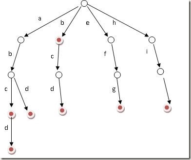

## Problem

#### [208. 实现 Trie (前缀树)](https://leetcode-cn.com/problems/implement-trie-prefix-tree/)

++

难度中等1065

**[Trie](https://baike.baidu.com/item/字典树/9825209?fr=aladdin)**（发音类似 "try"）或者说 **前缀树** 是一种树形数据结构，用于高效地存储和检索字符串数据集中的键。这一数据结构有相当多的应用情景，例如自动补完和拼写检查。

请你实现 Trie 类：

- `Trie()` 初始化前缀树对象。
- `void insert(String word)` 向前缀树中插入字符串 `word` 。
- `boolean search(String word)` 如果字符串 `word` 在前缀树中，返回 `true`（即，在检索之前已经插入）；否则，返回 `false` 。
- `boolean startsWith(String prefix)` 如果之前已经插入的字符串 `word` 的前缀之一为 `prefix` ，返回 `true` ；否则，返回 `false` 。

 

------

### Note

- 由字符串搭建一个树
- 假设有b，abc，abd，bcd，abcd，efg，hii 这6个单词,那我们创建trie树就得到(https://zhuanlan.zhihu.com/p/28891541)
  - 每个节点有两个成员变量：
    - Trie* next[26]; 意味着每个节点有26个分支
    - bool isEnd = false; 记录了从根节点开始，到该节点为止，是一个存下的字符（true）,或者仅仅是某些string的前缀（false）;

- 

------

### Complexity

- 时间O：
- 空间O：

------

### Python

```python

```

### C++

```C++
class Trie {
private:
    bool isEnd = false;
    Trie* next[26]; // 标致着有26个字符，在一个节点有26个分支
    // 或者是采用vector存储指针：
    // vector<TrieNode*> children;
    // TrieNode() : isWord(false), children(26, nullptr) {
    // }
    

public:
    Trie() {
        isEnd = false;
        memset(next, 0, sizeof(next)); //为指针数组设置为null
        // 或者
        //for(int i = 0; i < 26; i++){
        //    this->next[i] = nullptr;
        //}
    }

    // 析构函数中将指针数组指向的trie节点内存释放
    ~Trie() {
        for (auto& c : next)
            delete c;
    }

    void insert(string word) {
        Trie* node = this;
        for(char c: word){
            if(node->next[c - 'a'] == NULL){
                node->next[c - 'a'] = new Trie();
            }
            node = node->next[c - 'a'];
        }
        node->isEnd = true; // 设置从根节点到该位置是一个存下的字符串
    }
    
    bool search(string word) {
        Trie* node = this;
        for(char c: word){
            if(node->next[c - 'a'] == NULL){
                return false;
            }
            node = node->next[c - 'a'];
        }
        return node->isEnd;  // 已经顺利走完所有的节点，看该节点是否存下了字符串
    }
    
    bool startsWith(string prefix) {
        Trie* node = this;
        for(char c: prefix){
            if(node->next[c - 'a'] == NULL){
                return false;
            }
            node = node->next[c - 'a'];
        }
        return true; // 走到该位置，路径畅通，肯定存在以该string为首的字符串
    }
};

/**
 * Your Trie object will be instantiated and called as such:
 * Trie* obj = new Trie();
 * obj->insert(word);
 * bool param_2 = obj->search(word);
 * bool param_3 = obj->startsWith(prefix);
 */
```


From : https://github.com/dahaiyidi/awsome-leetcode
