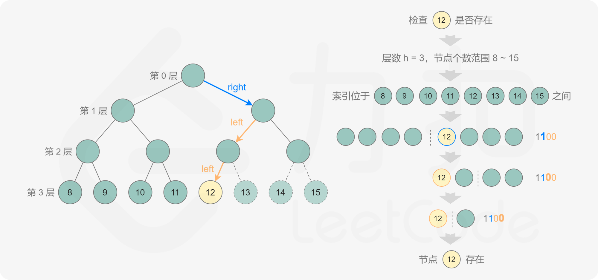

## Problem

#### [222. 完全二叉树的节点个数](https://leetcode-cn.com/problems/count-complete-tree-nodes/)

++

难度中等598

给你一棵 **完全二叉树** 的根节点 `root` ，求出该树的节点个数。

[完全二叉树](https://baike.baidu.com/item/完全二叉树/7773232?fr=aladdin) 的定义如下：在完全二叉树中，除了最底层节点可能没填满外，其余每层节点数都达到最大值，并且最下面一层的节点都集中在该层最左边的若干位置。若最底层为第 `h` 层，则该层包含 `1~ 2h` 个节点

**进阶：**遍历树来统计节点是一种时间复杂度为 `O(n)` 的简单解决方案。你可以设计一个更快的算法吗？

------

### Note

- 如按照层序遍历的方法，则时间复杂度是n, 空间复杂度是n

- 还有二分查找+位运算的方法：https://leetcode-cn.com/problems/count-complete-tree-nodes/solution/wan-quan-er-cha-shu-de-jie-dian-ge-shu-by-leetco-2/

- 按照图中层的序号，完全二叉树的个数所在的范围是

- $$
  [2^{h}, 2^{h+1}-1]
  $$

- 因此，可以根据二分法，判断mid是否在树中，然后在决定往哪个方向缩小搜索范围。

- 怎么判断一个数是否存在？

- k 的二进制表示包含 h+1位，其中最高位是 1，其余各位从高到低表示从根节点到第 k个节点的路径: 0表示移动到左子节点，1 表示移动到右子节点。

- 

------

### Complexity

- 时间O：(logn)^2.   二分需要logn,每一次二分还需要判断mid是否存在于树中（从根节点到叶节点），也是logn，因此时间复杂度是(logn)^2.
- 空间O：1

------

### Python

```python

class Solution:
    def exist(self, root, level, n):
        bit = (1 << (level - 1))
        while bit:
            if(bit & n): #右节点
                root = root.right
            else:
                root = root.left
            bit >>= 1
        return root != None


    def countNodes(self, root: TreeNode) -> int:
        if not root:
            return 0

        level = 0
        node = root
        while node and node.left:
            level += 1
            node = node.left
        
        # 节点数的范围为：[2^level, 2^(level+1) - 1]
        low = (1 << level)
        high = (1 << (level + 1)) - 1

        while low < high:
            mid = low + ((high - low + 1) >> 1)  ######一定要+1，否则会陷入死循环, 移位需要加上()
            print(mid)
            if self.exist(root, level, mid):
                low = mid
            else:
                high = mid - 1
        return low
```

### C++

```C++
class Solution {
public:
    int countNodes(TreeNode* root) {
        if (root == nullptr) {
            return 0;
        }
        int level = 0;
        TreeNode* node = root;
        while (node->left != nullptr) {
            level++;
            node = node->left;
        }
        int low = 1 << level, high = (1 << (level + 1)) - 1;
        while (low < high) {
            int mid = (high - low + 1) / 2 + low;
            if (exists(root, level, mid)) {
                low = mid;
            } else {
                high = mid - 1;
            }
        }
        return low;
    }

    bool exists(TreeNode* root, int level, int k) {
        int bits = 1 << (level - 1);
        TreeNode* node = root;
        while (node != nullptr && bits > 0) {
            if (!(bits & k)) {
                node = node->left;
            } else {
                node = node->right;
            }
            bits >>= 1;
        }
        return node != nullptr;
    }
};

```


From : https://github.com/dahaiyidi/awsome-leetcode
