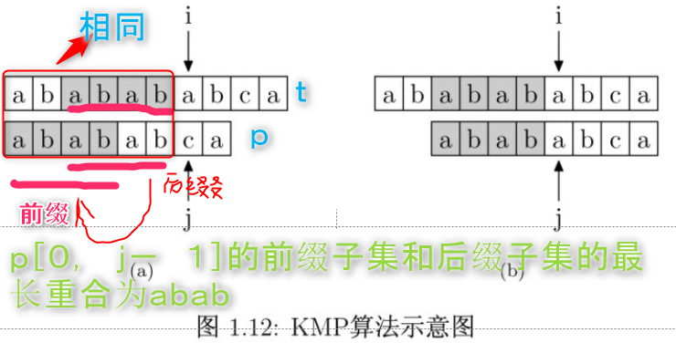

## Problem

#### [28. 实现 strStr()](https://leetcode-cn.com/problems/implement-strstr/)

实现 [strStr()](https://baike.baidu.com/item/strstr/811469) 函数。

给你两个字符串 `haystack` 和 `needle` ，请你在 `haystack` 字符串中找出 `needle` 字符串出现的第一个位置（下标从 0 开始）。如果不存在，则返回 `-1` 。

 

**说明：**

当 `needle` 是空字符串时，我们应当返回什么值呢？这是一个在面试中很好的问题。

对于本题而言，当 `needle` 是空字符串时我们应当返回 0 。这与 C 语言的 [strstr()](https://baike.baidu.com/item/strstr/811469) 以及 Java 的 [indexOf()](https://docs.oracle.com/javase/7/docs/api/java/lang/String.html#indexOf(java.lang.String)) 定义相符。

**示例 1：**

```
输入：haystack = "hello", needle = "ll"
输出：2
```

------

### Note

- 除了一点点的匹配之外，还有**KMP算法**，KMP算法的讲解：https://www.zhihu.com/question/21923021/answer/281346746

- 需要从`t`字符中找出`p`

- 最重要的是要求出pattern,即p的`next`数组（**部分匹配表(Partial Match Table)数组，PMT**）。为了方便，**`next[i]`的数组代表着`pattern[0, i - 1]`的前缀子集和后缀子集的交集的最长字符串长度**。在此处，字符串本身不是自己的子串。

- 有了next数组我们就可以在不匹配的地方（也就是`t[i] != t[j]`时），i保持不动，`j`则跳转到pattern中的`next[j]`位置，也就是下一个比较的是`t[i] `和`p[next[j]]`是否相等

- 为什么是`next[j]`???（**这是理解KMP算法的核心**）

  - 当`t[i] != t[j]`时，`t[i - j + 1,i]`与`p[0, j-1]`是相同的，那么`next[j] `代表着`p[0, j-1]`前缀子集和后缀子集的重合元素的最长长度。
  - 为了下一次不再从头开始比较，要寻找**`t[i]`之前紧邻的某些字符串**和**p的前面几个字符(前缀)**是相同的，找到最长的这几个字符即可。举个例子：
  - 从下图中可以看到，从next数组中可以查询`p[0, j-1]`的前缀子集和后缀子集的最长重合元素是`abab`，即`next[j] = 4`， 在下一次比较中可以直接从`next[j]=4`开始比较，而同时i无需移动位置。

  

- 怎么求next数组？将p与自己匹配即可

- 注意：

  - **unsigned_int 与int 比较时需要转化为int, 否则unsigned int 与负数比较大小时会出错。**

  - 在sigend int 与unsigned int 比较中，自动将sigend int转换为unsigned int 

  - ```c++
    //例子1
    string s = "";
    for(int i = 0; i < s.length() - 1; ++i)  // 其实发生的比较是—— 0 < 4294967295, s.length() 是无符号的0， -1后变为非常大的数
    {
       cout << "s.length = " << s.length() << endl;
       break;
    }
    //例子2
    while(j < (int) p.size()) // 若不写(int),当j为-1，则此条件则永远不会成立
    ```

    


------

### Complexity

n: 待匹配字符串的长度

m: pattern字符串的长度。

- 时间O：O(n+m)

- 空间O：O(m)

  

------

### Python

```python

```

### C++

```C++
class Solution {
public:
    int strStr(string t, string p) {
        if(p == ""){
            return 0;
        }
        vector<int> next(p.size(), 0);
        next[0] = -1;
        int i = 0, j = -1;

        // 求next数组
        // 相当于pattern与自己匹配
        // p[0]不需要匹配，因为只有一个字符，没有子串。
        // 第一次匹配是p[1] 与p[0]匹配， p[1]代表后缀，p[0]代表前缀？？？？
        // 什么时候j=-1？ 1） 开始时， 2）p[i]!=p[0], j = next[0] = -1, 此时均需要++i, ++j
        while(i < p.size() - 1){
            if(j == -1 || p[i] == p[j]){
                i++;
                j++;
                next[i] = j; // 1） p[i] == p[j]时，很好理解；2）当从j==-1进来时，对于对应的两种情况都应该设置为：next[++i] = 0
            }
            else{
                j = next[j]; // next[j]由历史的j组成，则肯定不会越界。
            }
        }

        // 直解从头到尾匹配，将上面的程序复制下来进行简单的修改即可
        i = 0, j = 0;
        while(i < t.size() && j < (int) p.size()){ // 为什么要加int？？？，因为p.size() 是unsigned int， 在与负数比较时会出现问题。 -1 < p.size() 总是不成立。 因此需要(int) p.size()然后再比较
            if(j == -1 || t[i] == p[j]){
                i++;
                j++;
            }
            else{
                j = next[j];
            }
        }
        if(j == p.size()){
            return i - j;
        }
        else{
            return -1;
        }

    }
};
```


From : https://github.com/dahaiyidi/awsome-leetcode
