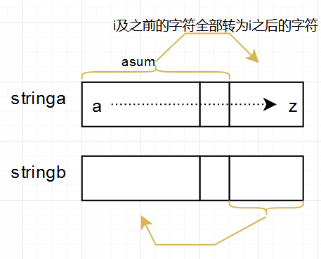

## Problem

#### [1737. 满足三条件之一需改变的最少字符数](https://leetcode-cn.com/problems/change-minimum-characters-to-satisfy-one-of-three-conditions/)

++

难度中等48

给你两个字符串 `a` 和 `b` ，二者均由小写字母组成。一步操作中，你可以将 `a` 或 `b` 中的 **任一字符** 改变为 **任一小写字母** 。

操作的最终目标是满足下列三个条件 **之一** ：

- `a` 中的 **每个字母** 在字母表中 **严格小于** `b` 中的 **每个字母** 。
- `b` 中的 **每个字母** 在字母表中 **严格小于** `a` 中的 **每个字母** 。
- `a` 和 `b` **都** 由 **同一个** 字母组成。

返回达成目标所需的 **最少** 操作数*。*

------

### Note

- 利用了前缀和、哈希表的概念
- 统计字符在a， b的出现的次数（哈希表）
- 然后从a遍历到y，计算前缀和asum, bsum,对于当前位置i(i是指代了从a到z)，`min(  res,    asum + nb - bsum,    na - asum + bsum,     na - acnt[i] + nb - bcnt[i])`。 其中：
  - 满足第二个条件：asum + nb - bsum代表将a中位置i及之前所有字符变换为位置i之后的字母，将b中i之后所有的字符转换为位置i之前的字母。
  - 
  - 满足第一个条件：na - asum + bsum类似。
  - 满足第三个条件：na - acnt[i] + nb - bcnt[i] 代表将a和b中所有的字母转换为位置i代表的字符的情况。
  
- 遍历后，还要计算在字母z的位置上的情况，min(res, na - acnt[25] + nb - bcnt[25])
- **注意python中的最大值与最小值：sys.maxsize, sys.minsize**
- **C++中为：INT_MIN， INT_MAX**

------

### Complexity

- 时间O：a+b
- 空间O：1

------

### Python

```python
class Solution:
    def minCharacters(self, a: str, b: str) -> int:
        na = len(a)
        nb = len(b)
        acnt = [0] * 26
        bcnt = [0] * 26

        # 统计字符出现的次数
        for ch in a:
            acnt[ord(ch) - ord('a')] += 1
        for ch in b:
            bcnt[ord(ch) - ord('a')] += 1
        
        asum, bsum = 0, 0
        res = sys.maxsize
        for i in range(25):
            asum += acnt[i]
            bsum += bcnt[i]

            res = min(res, asum + nb - bsum, na - asum + bsum, na - acnt[i] + nb - bcnt[i])
        return min(res, na - acnt[25] + nb - bcnt[25])
```

### C++

```C++
class Solution {
public:
    int minCharacters(string a, string b) {
        int na = a.size();
        int nb = b.size();

        int acnt[26] = {0};
        int bcnt[26] = {0};

        for(auto& ch: a){
            acnt[ch - 'a'] += 1;
        }
        for(auto& ch: b){
            bcnt[ch - 'a'] += 1;
        }

        int res = INT_MAX;
        int asum = 0;
        int bsum = 0;
        for(int i = 0; i < 25; i++){
            asum += acnt[i];
            bsum += bcnt[i];
            res = min(min(res, na - acnt[i] + nb - bcnt[i]), min(asum + nb - bsum, na - asum + bsum));
        }
        return min(res, na - acnt[25] + nb - bcnt[25]);
    }
};
```


From : https://github.com/dahaiyidi/awsome-leetcode
