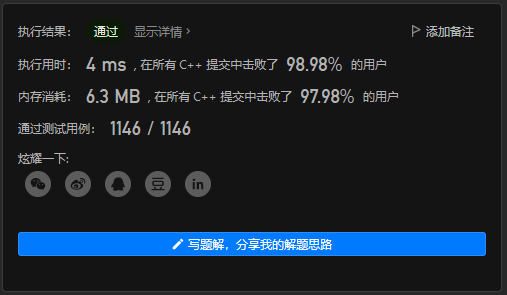
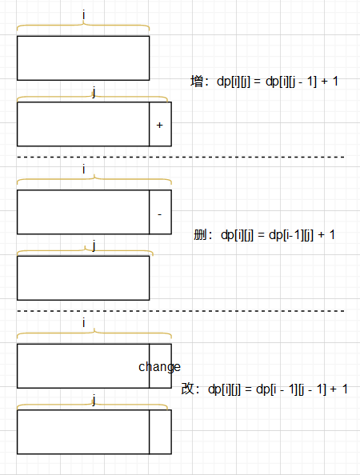

## Problem

#### [72. 编辑距离](https://leetcode.cn/problems/edit-distance/)

给你两个单词 `word1` 和 `word2`， *请返回将 `word1` 转换成 `word2` 所使用的最少操作数*  。

你可以对一个单词进行如下三种操作：

- 插入一个字符
- 删除一个字符
- 替换一个字符

------

### Note

- 很多大佬和官方的答案的空间复杂度是m*n,但是我提供修改为线性空间复杂度的方法！非常简单！！

- 

- 首先回顾

- ```c++
          // 状态：dp[i,j] 为从word1[0...i-1] 变换到word2[0...j-1]所需要的最少操作数
          // 转移：如果word1[i-1] != word2[j-1]  增： dp[i, j] = dp[i, j-1] + 1
          //       							删： dp[i, j] = dp[i - 1, j] + 1
          //       							改： dp[i, j] = dp[i - 1, j - 1] + 1
          //       如果word1[i-1] == word2[j-1]： dp[i, j] = dp[i - 1, j -1]
  ```

- 状态方程推导：
      
- 
      
- 虽然从状态转移方程中看，是不能优化空间复杂度的，但是事实上可以优化为线性复杂度，原因是：**毕竟它只用到最多3个位置（有限位数）的历史数字，而不是需要遍历一遍所有的数值**

- 实际上可以通过额外两个变量记录`dp[i-1][j-1]`就能直接将空间复杂度优化为n，具体见代码

------

### Complexity

- 时间O：m*n
- 空间O：n

------

### Python

```python

```

### C++

```C++
// m*n 空间复杂度
class Solution {
public:
    int minDistance(string word1, string word2) {
        // 状态：dp[i,j] 为从word1[0...i-1] 变换到word2[0...j-1]所需要的最少操作数
        // 转移：如果word1[i-1] != word2[j-1] 增： dp[i, j] = dp[i, j-1] + 1
        //       删： dp[i, j] = dp[i - 1, j] + 1
        //       改： dp[i, j] = dp[i - 1, j - 1] + 1
        //       如果word1[i-1] == word2[j-1]： dp[i, j] = dp[i - 1, j -1]

        int m = word1.size();
        int n = word2.size();
        vector<vector<int>> dp(m + 1, vector<int>(n + 1));

        // 初始化
        for(int i = 0; i < m + 1; ++i)
        {
            dp[i][0] = i;
        }        
        for(int j = 0; j < n + 1; ++j)
        {
            dp[0][j] = j;
        }

        for(int i = 1; i < m + 1; ++i)
        {
            for(int j = 1; j < n + 1; ++j)
            {
                if(word1[i-1] == word2[j-1])
                {
                    dp[i][j] = dp[i - 1][j - 1];
                }
                else
                {
                    dp[i][j] = 1 + min(min(dp[i][j-1], dp[i - 1][j]), dp[i - 1][j - 1]);
                }
            }
        }
        return dp[m][n];


    }
};

// 优化为线性空间复杂度

class Solution {
public:
    int minDistance(string word1, string word2) {
        // 状态：dp[i,j] 为从word1[0...i-1] 变换到word2[0...j-1]所需要的最少操作数
        // 转移：如果word1[i-1] != word2[j-1] 增： dp[i, j] = dp[i, j-1] + 1
        //       删： dp[i, j] = dp[i - 1, j] + 1
        //       改： dp[i, j] = dp[i - 1, j - 1] + 1
        //       如果word1[i-1] == word2[j-1]： dp[i, j] = dp[i - 1, j -1]

        int m = word1.size();
        int n = word2.size();
        vector<int> dp(n + 1);

        // 初始化  代表从各种长度的字符串到string的转化    
        for(int j = 0; j < n + 1; ++j)
        {
            dp[j] = j;
        }
        
        int pre = 0;
        int cur = 0;
        for(int i = 1; i < m + 1; ++i)
        {
            pre =  dp[0];  // pre 代表dp[i- 1][j-1]
            dp[0] = i;
            for(int j = 1; j < n + 1; ++j)
            {
                cur = dp[j]; // 在修改值之前先保存下来，作为下一个循环的dp[i- 1][j-1]
                if(word1[i-1] == word2[j-1])
                {
                    dp[j] = pre;
                }
                else
                {
                    dp[j] = 1 + min(min(dp[j-1], dp[j]), pre);
                }
                pre = cur;// 作为下一个循环的dp[i- 1][j-1]
            }
        }
        return dp[n];


    }
};
```

点击链接查看leetcode题目总结。若不总结，则永远陷入刷题的无底洞！**你所畏惧的一切，终将一个个地面对！**

From : :heart: https://github.com/dahaiyidi/awsome-leetcode
