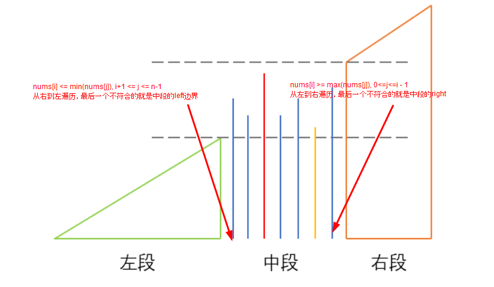

## Problem

#### [581. 最短无序连续子数组](https://leetcode.cn/problems/shortest-unsorted-continuous-subarray/)

给你一个整数数组 `nums` ，你需要找出一个 **连续子数组** ，如果对这个子数组进行升序排序，那么整个数组都会变为升序排序。

请你找出符合题意的 **最短** 子数组，并输出它的长度。

 

**示例 1：**

```
输入：nums = [2,6,4,8,10,9,15]
输出：5
解释：你只需要对 [6, 4, 8, 10, 9] 进行升序排序，那么整个表都会变为升序排序。
```

**示例 2：**

```
输入：nums = [1,2,3,4]
输出：0
```

**示例 3：**

```
输入：nums = [1]
输出：0
```

 **进阶：**你可以设计一个时间复杂度为 `O(n)` 的解决方案吗？

------

### Note

- 是一种找规律的题目。
- 
- https://leetcode.cn/problems/shortest-unsorted-continuous-subarray/solution/si-lu-qing-xi-ming-liao-kan-bu-dong-bu-cun-zai-de-/

------

### Complexity

- 时间O：n
- 空间O：1

------

### Python

```python

```

### C++

```C++
class Solution {
public:
    int findUnsortedSubarray(vector<int>& nums) {
        int max_val = INT_MIN;
        int min_val = INT_MAX;
        int left = -1;
        int right = -1;
        int n = nums.size() - 1;
        for(int i = 0; i < nums.size(); ++i)
        {
            // 右侧边界
            if(nums[i] >= max_val)
            {
                max_val = nums[i];
            }
            else
            {
                // 不符合条件，最后一个不符合条件的就是目标数组的right边界
                right = i;
            }

            // 左侧边界
            if(nums[n - i] <= m_val)
            {
                min_val = nums[n - i];
            }
            else
            {
                // 不符合条件，最后一个不符合条件的就是目标数组的left边界
                left = n - i;
            }

        }
        return right == -1? 0 : right - left + 1;


    }
};
```


From : https://github.com/dahaiyidi/awsome-leetcode
