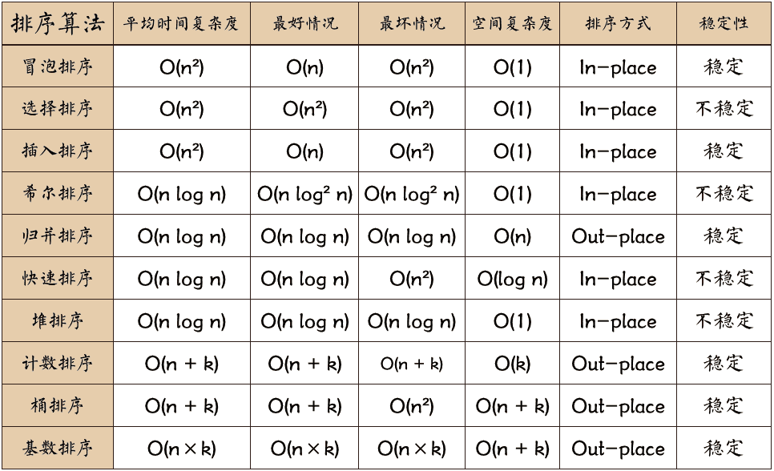

## Problem

#### [912. 排序数组](https://leetcode-cn.com/problems/sort-an-array/)

++

难度中等460

给你一个整数数组 `nums`，请你将该数组升序排列。


------

### Note

- 快排（分治）—— 时间：nlogn,  空间：最坏情况下需 O(*n*) 的空间，最优情况下每次都平衡为O(logn)
- 归并排序（分治）——时间：nlogn, 空间n。 使用额外的数据进行有序子数组合并。**如果将快排和归并排序看做是二叉树的遍历时，快排可以类比前序遍历，在进入左右子问题前，将该层问题解决；归并排序可类比后续遍历，在左右子问题都已经解决后，再解决该层问题（即merge）。正因此，两者的写法非常相似**
- 插入排序——时间：n^2, 空间1，在数组「几乎有序」的前提下，「插入排序」的时间复杂度可以达到 O(N)；在短数组上表现良好。
  - 由于「插入排序」在「几乎有序」的数组上表现良好，特别地，在「短数组」上的表现也很好。因为「短数组」的特点是：每个元素
- 堆排序——时间：nlogn, 空间：1
- 

------

### Complexity

- 时间O：
- 空间O：

------

### Python

```python
方法1：快排
class Solution:
    def partition(self, nums, l, r):
        pivot = random.randint(l, r)
        # 将随机选中的值移动到最后
        nums[pivot], nums[r] = nums[r], nums[pivot]
        # i 为下一个<nums[pivot] 的值存放的地方
        # 最终i的位置为nums[pivot]应该交换到的地方
        i = l 
        for j in range(l, r):
            if nums[j] < nums[r]:
                nums[j], nums[i] = nums[i], nums[j]
                i += 1
                
        nums[r], nums[i] = nums[i], nums[r]
        return i

    def quicksort(self, nums, l, r):
        if l >= r:
            return
        
        i = self.partition(nums, l, r)
        self.quicksort(nums, l, i - 1)
        self.quicksort(nums, i + 1, r)
        

    def sortArray(self, nums: List[int]) -> List[int]:
        self.quicksort(nums, 0, len(nums) - 1);
        return nums
    
    C++版本的快排在下面的code block
    
   
    
方法2 归并排序
c++ 版本见下

方法2-写法2
class Solution:
    def mergetwo(self, nums, left, mid, right, temp):
        temp[left: right + 1] = nums[left: right + 1]
        i = left
        j = mid + 1
        for k in range(left, right + 1):
            if i == mid + 1:
                # 左段已经遍历完毕
                nums[k] = temp[j]
                j += 1
            elif j == right + 1:
                # 右段已经遍历完毕
                nums[k] = temp[i]
                i += 1
            elif temp[i] <= temp[j]:  # 必须有等号，保证排序的稳定性
                # 应该处理左段
                nums[k] = temp[i]
                i += 1
            elif temp[i] > temp[j]:
                # 应该处理右段
                nums[k] = temp[j]
                j += 1

    def mergesort(self, nums, left, right, temp):
        if left >= right:
            return
        mid = left + ((right - left) >> 1)
        self.mergesort(nums, left, mid, temp)
        self.mergesort(nums, mid + 1, right, temp)
        if nums[mid] <= nums[mid + 1]:
            # 本身就是有序的，无需merge
            return
        self.mergetwo(nums, left, mid, right, temp)

    def sortArray(self, nums: List[int]) -> List[int]:
        temp = [0] * len(nums)
        self.mergesort(nums, 0, len(nums) - 1, temp)
        return nums

    
    
方法3 插入排序 （超时）
class Solution:
    def sortArray(self, nums: List[int]) -> List[int]:
        for i in range(1, len(nums)):
            j = i
            temp = nums[j]
            while j - 1 >= 0 and nums[j - 1] > temp:
                nums[j] = nums[j - 1]
                j -= 1
            nums[j] = temp
        return nums
    
方法4 堆排序：
class Solution:
    def max_heapify(self, heap, root, heap_len):
        # 完成下沉操作
        # 若root的左右子树（若有）的某一个值大于root的值，则将该最大值位置与root相交换（将root下移），然后在新的root上 ，重复该操作，直到到达底部或root值已经大于左右子树的值。
        p = root
        while p * 2 + 1 <= heap_len - 1:  # 是否有左子节点
            left, right = p * 2 + 1, p * 2 + 2
            # 先选出left还是right值较大的位置，记为nx
            if right <= heap_len - 1 and heap[right] > heap[left]:
                nx = right
            else:
                nx = left
            
            if heap[p] < heap[nx]:
                # 如果heap[p] < heap[nx], 则需要将两者交换 
                # 也就说说，小的值向下，大的子节点向上。交换后，继续看看是否可以继续向下，直到值大于子节点值，或者没有子节点。
                # 将p下沉到nx位置上
                heap[p], heap[nx] = heap[nx], heap[p]
                p = nx
            else:
                # 已经满足p是子树的最大值
                break

    def heap_sort(self, nums):
        nums_len = len(nums)
        # 建造最大堆
        for i in range(nums_len - 1, -1, -1):
            self.max_heapify(nums, i, nums_len)

        # 一步步将最大值移动到-1， -2，...等位置
        for i in range(nums_len - 1, -1, -1):
            # 将最大堆的首元素（最大值）与最后一个元素交换
            nums[0], nums[i] = nums[i], nums[0]
            # 将新的根节点下沉到合适位置
            self.max_heapify(nums, 0, i)

    def sortArray(self, nums: List[int]) -> List[int]:
        self.heap_sort(nums)
        return nums

```

### C++

```C++
C++ 快排
class Solution {
public:
    int partition(vector<int>& nums, int left, int right)
    {
        int pivot = (rand() % (right - left + 1)) + left;
        swap(nums[pivot], nums[right]);
        int i = left;
        for(int j = left; j < right; ++j)
        {
            if(nums[j] < nums[right])
            {
                swap(nums[i], nums[j]);
                ++i;
            }
        }
        swap(nums[i], nums[right]);
        return i;
    }
    void quicksort(vector<int>& nums, int left, int right)
    {
        if(left >= right)
        {
            return;
        }
        int i = partition(nums, left, right);
        quicksort(nums, left, i - 1);
        quicksort(nums, i + 1, right);
    }
    vector<int> sortArray(vector<int>& nums) {
        quicksort(nums, 0, nums.size() - 1);
        return nums;
    }
};

//归并排序

方法2
class Solution {
public:
    void mergeTwo(vector<int>& nums, int left, int mid, int right, vector<int>& tmp){
        int i = left;
        int j = mid + 1;
        int k = left;
        while(i <= mid && j <= right){
            if(nums[i] <= nums[j]){      // 等号不要忘记
                tmp[k++] = nums[i++];
            }
            else if(nums[i] > nums[j]){
                tmp[k++] = nums[j++];
            }
        }

        while(i <= mid){
            tmp[k++] = nums[i++];
        }
        while(j <= right){
            tmp[k++] = nums[j++];
        }

        // 从排序后的tmp中复制到nums中
        for(i = left; i <= right; i++){
            nums[i] = tmp[i];
        }
    }
    void mergeSort(vector<int>& nums, int left, int right, vector<int>& tmp){
        if(left >= right){
            return;
        }
        int mid = left + ((right - left) >> 1);
        mergeSort(nums, left, mid, tmp);
        mergeSort(nums, mid + 1, right, tmp);
        mergeTwo(nums, left, mid, right,  tmp);
    }

    vector<int> sortArray(vector<int>& nums) {
        vector<int> tmp((int)nums.size(), 0);
        mergeSort(nums, 0, nums.size() - 1, tmp);
        return nums;
    }
};

```


From : https://github.com/dahaiyidi/awsome-leetcode
