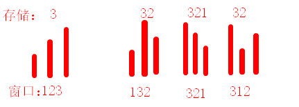

## Problem

#### [剑指 Offer 59 - I. 滑动窗口的最大值](https://leetcode.cn/problems/hua-dong-chuang-kou-de-zui-da-zhi-lcof/)

给定一个数组 `nums` 和滑动窗口的大小 `k`，请找出所有滑动窗口里的最大值。

**示例:**

```
输入: nums = [1,3,-1,-3,5,3,6,7], 和 k = 3
输出: [3,3,5,5,6,7] 
解释: 

  滑动窗口的位置                最大值
---------------               -----
[1  3  -1] -3  5  3  6  7       3
 1 [3  -1  -3] 5  3  6  7       3
 1  3 [-1  -3  5] 3  6  7       5
 1  3  -1 [-3  5  3] 6  7       5
 1  3  -1  -3 [5  3  6] 7       6
 1  3  -1  -3  5 [3  6  7]      7
```

 

**提示：**

你可以假设 *k* 总是有效的，在输入数组不为空的情况下，1 ≤ k ≤ 输入数组的大小。

注意：本题与主站 239 题相同：[239. 滑动窗口最大值](https://leetcode.cn/problems/sliding-window-maximum/)

------

### Note

- 使用deque保存当前窗口内的元素：按照遍历顺序，且要求序列从大到小（如果当前值 > back(), 则需要不停地pop_back），这样front总是当前窗口的最大值
- 当有元素从窗口中滑走时，则可以判断是否是最大的元素，来决定是否也应该删除front
- 
- 一个重要的心得是：
  - **当面对各种判断条件时，可以先考虑一般化的场景将代码写下来，然后再根据特殊场景优化。如果一开始就考虑各种复杂的判断条件，则容易扰乱认知。**

------

### Complexity

- 时间O：n
- 空间O：k

------

### Python

```python

```

### C++

```C++
class Solution {
public:
    vector<int> maxSlidingWindow(vector<int>& nums, int k) {
        if(nums.size() == 0 || nums.size() < k)
        {
            return {};
        }
        deque<int> dq;
        vector<int> res;
        for(int i = 0; i < k; ++i)
        {
            while(!dq.empty() && dq.back() < nums[i])
            {
                dq.pop_back();
            }
            dq.push_back(nums[i]);
        }
        res.push_back(dq.front());
        for(int i = k; i < nums.size(); ++i)
        {
            // 看一下刚好不在窗口中的元素是否是最大值
            int remove_val = nums[i - k];
            if(remove_val == dq.front())
            {
                dq.pop_front();
            }

            // 将当前元素更新进入dq
            while(!dq.empty() && dq.back() < nums[i])
            {
                dq.pop_back();
            }
            dq.push_back(nums[i]);

            // 当前窗口的最大值
            res.push_back(dq.front());
        }
        return res;
    }
};

// 也可以直接将索引存入deque中，这样deque就不用记录相等的元素了。
class Solution {
public:
    vector<int> maxSlidingWindow(vector<int>& nums, int k) {
        vector<int> res;
        if(nums.size() < k){
            return res;
        }
        deque<int> q;
        for(int i = 0; i < nums.size(); i++){
            while(!q.empty() && nums[i] >= nums[q.back()]){
                q.pop_back();
            }
            q.push_back(i);
            
            // 更新窗口
            if(i - q.front() + 1 > k){
                q.pop_front();
            }
            // q.front()是当前窗口最大值
            if(i >= k - 1){
                res.push_back(nums[q.front()]);
            }
        }
        return res;

    }
};
```

点击链接查看leetcode题目总结。若不总结，则永远陷入刷题的无底洞！**你所畏惧的一切，终将一个个地面对！**

From : :heart: https://github.com/dahaiyidi/awsome-leetcode
