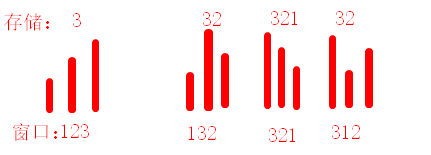

## Problem


#### [239. 滑动窗口最大值](https://leetcode-cn.com/problems/sliding-window-maximum/)

++

难度困难1342

给你一个整数数组 `nums`，有一个大小为 `k` 的滑动窗口从数组的最左侧移动到数组的最右侧。你只可以看到在滑动窗口内的 `k` 个数字。滑动窗口每次只向右移动一位。

返回滑动窗口中的最大值。

 

------

### Note

- 一个集合内，只存储窗口内的存储逻辑如下：
  - 当前nums[i] >=窗口内的位于i之前的其他元素，则需要将它们都pop。因为它们在后边肯定不会被用到，而nums[i]有可能被用到
  - 当前nums[i]<窗口内的位于i之前的其他元素，则无需pop前面的数值，因为会被用到，同时nums[i]在未来也可能被用到
- 
- 通过双向队列实现两侧的元素的高效操作，首元素是当前窗口中最大的数值。
- 一个重要的心得是：
  - **当面对各种判断条件时，可以先考虑一般化的场景将代码写下来，然后再根据特殊场景优化。如果一开始就考虑各种复杂的判断条件，则容易扰乱认知。**

------

### Complexity

- 时间O：n
- 空间O：k

------

### Python

```python
class Solution:
    def maxSlidingWindow(self, nums: List[int], k: int) -> List[int]:
        if len(nums) < k:
            return []

        q = collections.deque()
        res = []
        for i in range(len(nums)):
            # 当前值大于前面q中代表的值
            while q and nums[i] >= nums[q[-1]]:
                q.pop()
            
            # 添加当前节点
            q.append(i)

            # 当q所代表的窗口长度超出范围，需要popleft
            # 可以不需要while,因为每次超出范围都会及时的popleft,长度最多也就超出1
            if i - q[0] + 1 > k:
                q.popleft()
            
            # 窗口长度满足k
            if i >= k - 1:
                res.append(nums[q[0]])
        return res
```

### C++

```C++
class Solution {
public:
    vector<int> maxSlidingWindow(vector<int>& nums, int k) {
        vector<int> res;
        if(nums.size() < k){
            return res;
        }
        deque<int> q;
        for(int i = 0; i < nums.size(); i++){
            while(!q.empty() && nums[i] >= nums[q.back()]){
                q.pop_back();
            }
            q.push_back(i);
            if(i - q.front() + 1 > k){
                q.pop_front();
            }
            if(i >= k - 1){
                res.push_back(nums[q.front()]);
            }
        }
        return res;

    }
};
```


From : https://github.com/dahaiyidi/awsome-leetcode
